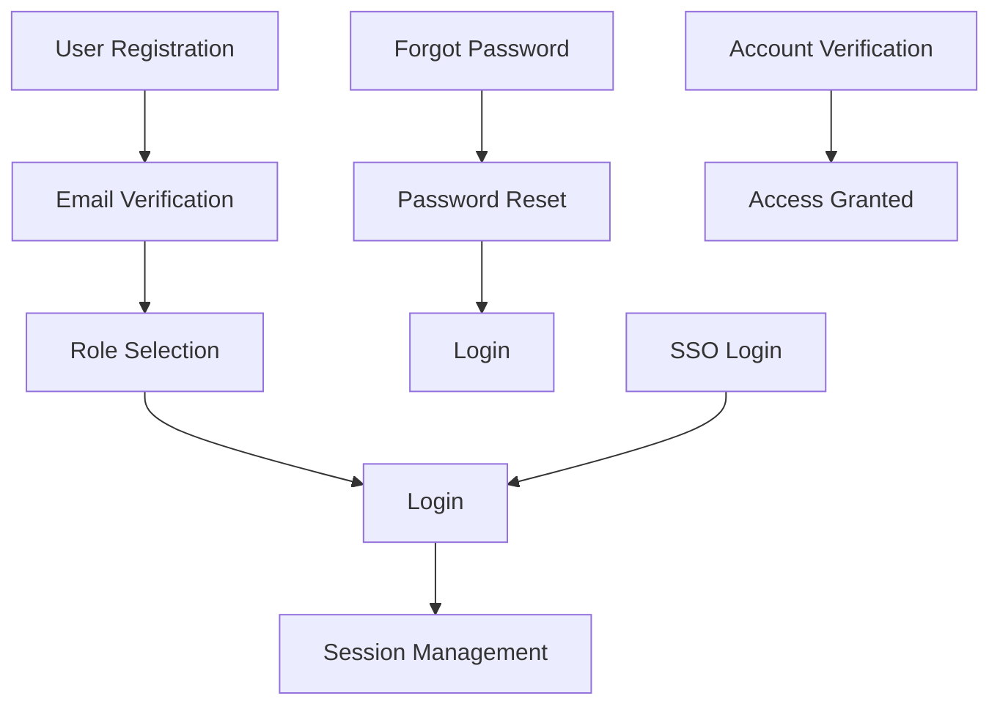

# Complete Authentication API Documentation

## Overview

This document provides comprehensive API documentation for all authentication
endpoints required by the PrepHired application, based on the `app/(auth)`
folder structure and implemented components.

## Base URL

```
https://api.prephired.com/api/auth
```

## Authentication Flow Overview



---

## 🔐 Core Authentication Endpoints

### 1. User Registration

**Endpoint:** `POST /api/auth/signup`

**Description:** Create a new user account

**Request Body:**

```json
{
  "firstName": "John",
  "lastName": "Doe",
  "email": "john.doe@example.com",
  "phone": "+1234567890",
  "password": "SecurePassword123",
  "confirmPassword": "SecurePassword123",
  "acceptTerms": true,
  "acceptPrivacy": true,
  "marketingEmails": false,
  "tenantSlug": "company-name",
  "invitationToken": "invite-123"
}
```

**Request Schema:**

```typescript
interface RegisterRequest {
  firstName: string; // Required, min 2 chars
  lastName: string; // Required, min 2 chars
  email: string; // Required, valid email format
  phone: string; // Required, international format
  password: string; // Required, min 8 chars
  confirmPassword: string; // Required, must match password
  acceptTerms: boolean; // Required, must be true
  acceptPrivacy?: boolean; // Optional
  marketingEmails?: boolean; // Optional
  tenantSlug?: string; // Optional, for tenant creation
  invitationToken?: string; // Optional, for invited users
}
```

**Validation Rules:**

- `firstName`: Required, minimum 2 characters
- `lastName`: Required, minimum 2 characters
- `email`: Required, valid email format
- `phone`: Required, international phone format (+1234567890)
- `password`: Required, minimum 8 characters
- `confirmPassword`: Required, must match password
- `acceptTerms`: Required, must be true
- `acceptPrivacy`: Optional boolean
- `marketingEmails`: Optional boolean
- `tenantSlug`: Optional string for tenant association
- `invitationToken`: Optional string for invited users

**Response (Success - 201):**

```json
{
  "success": true,
  "data": {
    "user": {
      "id": "user-123",
      "firstName": "John",
      "lastName": "Doe",
      "email": "john.doe@example.com",
      "phone": "+1234567890",
      "emailVerified": false,
      "phoneVerified": false,
      "status": "pending",
      "roles": ["user"],
      "permissions": ["read:own"],
      "createdAt": "2024-01-01T00:00:00.000Z",
      "updatedAt": "2024-01-01T00:00:00.000Z"
    },
    "message": "Account created successfully. Please verify your email.",
    "redirectTo": "/verify-account?type=register"
  },
  "error": null
}
```

**Response (Error - 400/409):**

```json
{
  "success": false,
  "data": null,
  "error": {
    "code": "EMAIL_EXISTS",
    "message": "Email address already registered",
    "field": "email"
  }
}
```

**Error Codes:**

- `VALIDATION_ERROR`: Form validation failed
- `EMAIL_EXISTS`: Email address already registered
- `PHONE_EXISTS`: Phone number already registered
- `INVALID_PASSWORD`: Password doesn't meet requirements
- `PASSWORDS_DONT_MATCH`: Password confirmation doesn't match
- `TERMS_NOT_ACCEPTED`: Terms and conditions not accepted
- `INVALID_INVITATION`: Invalid or expired invitation token

---

### 2. User Login

**Endpoint:** `POST /api/auth/signin`

**Description:** Authenticate existing user

**Request Body:**

```json
{
  "emailOrPhone": "john.doe@example.com",
  "password": "SecurePassword123",
  "rememberMe": false
}
```

**Request Schema:**

```typescript
interface LoginRequest {
  emailOrPhone: string; // Required, email or phone number
  password: string; // Required
  rememberMe?: boolean; // Optional, for extended sessions
}
```

**Validation Rules:**

- `emailOrPhone`: Required, valid email or phone format
- `password`: Required, minimum 1 character
- `rememberMe`: Optional boolean

**Response (Success - 200):**

```json
{
  "success": true,
  "data": {
    "user": {
      "id": "user-123",
      "firstName": "John",
      "lastName": "Doe",
      "email": "john.doe@example.com",
      "phone": "+1234567890",
      "avatarUrl": "https://example.com/avatar.jpg",
      "emailVerified": true,
      "phoneVerified": false,
      "status": "active",
      "roles": ["user"],
      "permissions": ["read:own"],
      "displayName": "John Doe",
      "initials": "JD",
      "createdAt": "2024-01-01T00:00:00.000Z",
      "updatedAt": "2024-01-01T00:00:00.000Z"
    },
    "session": {
      "id": "session-456",
      "userId": "user-123",
      "tenantId": "tenant-789",
      "expiresAt": "2024-01-02T00:00:00.000Z",
      "ipAddress": "127.0.0.1",
      "userAgent": "Mozilla/5.0...",
      "createdAt": "2024-01-01T00:00:00.000Z",
      "lastActivity": "2024-01-01T00:00:00.000Z"
    },
    "tenant": {
      "id": "tenant-789",
      "name": "Default Organization",
      "slug": "default",
      "status": "active",
      "country": "US",
      "timezone": "America/New_York",
      "language": "en",
      "currency": "USD"
    },
    "redirectTo": "/verify-account?type=login"
  },
  "error": null
}
```

**Response (Error - 400/401):**

```json
{
  "success": false,
  "data": null,
  "error": {
    "code": "INVALID_CREDENTIALS",
    "message": "Invalid email or password",
    "field": "emailOrPhone"
  }
}
```

**Error Codes:**

- `INVALID_CREDENTIALS`: Email/phone or password is incorrect
- `ACCOUNT_LOCKED`: Account is temporarily locked due to failed attempts
- `EMAIL_NOT_VERIFIED`: Email address not verified
- `ACCOUNT_INACTIVE`: Account is inactive or suspended
- `RATE_LIMIT_EXCEEDED`: Too many login attempts

---

### 3. User Logout

**Endpoint:** `POST /api/auth/signout`

**Description:** Invalidate user session

**Headers:**

```
Authorization: Bearer <access_token>
```

**Request Body:** None

**Response (Success - 200):**

```json
{
  "success": true,
  "data": {
    "message": "Logged out successfully",
    "redirectTo": "/login"
  },
  "error": null
}
```

**Response (Error - 401):**

```json
{
  "success": false,
  "data": null,
  "error": {
    "code": "UNAUTHORIZED",
    "message": "Invalid or expired token"
  }
}
```

---

### 4. Session Management

**Endpoint:** `GET /api/auth/session`

**Description:** Get current user session

**Headers:**

```
Authorization: Bearer <access_token>
```

**Response (Success - 200):**

```json
{
  "success": true,
  "data": {
    "user": {
      "id": "user-123",
      "firstName": "John",
      "lastName": "Doe",
      "email": "john.doe@example.com",
      "status": "active",
      "roles": ["user"],
      "permissions": ["read:own"]
    },
    "session": {
      "id": "session-456",
      "userId": "user-123",
      "tenantId": "tenant-789",
      "expiresAt": "2024-01-02T00:00:00.000Z",
      "lastActivity": "2024-01-01T00:00:00.000Z"
    },
    "tenant": {
      "id": "tenant-789",
      "name": "Default Organization",
      "slug": "default",
      "status": "active"
    }
  },
  "error": null
}
```

**Response (Error - 401):**

```json
{
  "success": false,
  "data": null,
  "error": {
    "code": "SESSION_EXPIRED",
    "message": "Session has expired"
  }
}
```

---

## 🔒 Password Management Endpoints

### 5. Forgot Password Request

**Endpoint:** `POST /api/auth/forgot-password`

**Description:** Send password reset link/OTP

**Request Body:**

```json
{
  "emailOrPhone": "john.doe@example.com"
}
```

**Request Schema:**

```typescript
interface ForgotPasswordRequest {
  emailOrPhone: string; // Required, email or phone number
}
```

**Validation Rules:**

- `emailOrPhone`: Required, valid email or phone format

**Response (Success - 200):**

```json
{
  "success": true,
  "data": {
    "message": "Password reset instructions sent",
    "resetTokenExpiry": "2024-01-01T01:00:00.000Z",
    "redirectTo": "/verify-account?type=forgot-password"
  },
  "error": null
}
```

**Response (Error - 400/404):**

```json
{
  "success": false,
  "data": null,
  "error": {
    "code": "USER_NOT_FOUND",
    "message": "No account found with this email/phone",
    "field": "emailOrPhone"
  }
}
```

**Error Codes:**

- `USER_NOT_FOUND`: No account found with provided email/phone
- `RATE_LIMIT_EXCEEDED`: Too many reset requests
- `ACCOUNT_LOCKED`: Account is locked

---

### 6. Password Reset

**Endpoint:** `POST /api/auth/reset-password`

**Description:** Reset password using reset token

**Request Body:**

```json
{
  "token": "reset-token-123",
  "password": "NewSecurePassword123",
  "confirmPassword": "NewSecurePassword123"
}
```

**Request Schema:**

```typescript
interface ResetPasswordRequest {
  token: string; // Required, reset token from email/SMS
  password: string; // Required, new password
  confirmPassword: string; // Required, password confirmation
}
```

**Validation Rules:**

- `token`: Required, valid reset token
- `password`: Required, minimum 8 characters, meets complexity requirements
- `confirmPassword`: Required, must match password

**Response (Success - 200):**

```json
{
  "success": true,
  "data": {
    "message": "Password reset successful",
    "redirectTo": "/login"
  },
  "error": null
}
```

**Response (Error - 400/410):**

```json
{
  "success": false,
  "data": null,
  "error": {
    "code": "INVALID_TOKEN",
    "message": "Invalid or expired reset token",
    "field": "token"
  }
}
```

**Error Codes:**

- `INVALID_TOKEN`: Invalid or expired reset token
- `PASSWORDS_DONT_MATCH`: Password confirmation doesn't match
- `INVALID_PASSWORD`: Password doesn't meet requirements

---

## ✅ Verification Endpoints

### 7. Account Verification

**Endpoint:** `POST /api/auth/verify-account`

**Description:** Verify account with OTP

**Request Body:**

```json
{
  "otp": "123456"
}
```

**Request Schema:**

```typescript
interface VerifyAccountRequest {
  otp: string; // Required, 4 or 6 digit OTP
}
```

**Validation Rules:**

- `otp`: Required, 4 or 6 digit numeric code

**Context Parameters:**

- Verification type is determined from URL query parameter:
  `?type=register|login|forgot-password`

**Response (Success - 200):**

```json
{
  "success": true,
  "data": {
    "message": "Account verified successfully",
    "redirectTo": "/select-role" // or /dashboard or /reset-password based on type
  },
  "error": null
}
```

**Response (Error - 400/410):**

```json
{
  "success": false,
  "data": null,
  "error": {
    "code": "INVALID_OTP",
    "message": "Invalid or expired OTP code",
    "field": "otp"
  }
}
```

**Error Codes:**

- `INVALID_OTP`: Invalid or expired OTP code
- `OTP_EXPIRED`: OTP has expired
- `MAX_ATTEMPTS_EXCEEDED`: Too many verification attempts

---

### 8. Resend Verification OTP

**Endpoint:** `POST /api/auth/resend-otp`

**Description:** Resend verification code

**Request Body:**

```json
{
  "emailOrPhone": "john.doe@example.com",
  "type": "register"
}
```

**Request Schema:**

```typescript
interface ResendOTPRequest {
  emailOrPhone: string; // Required, email or phone number
  type: 'register' | 'login' | 'forgot-password'; // Required, verification type
}
```

**Validation Rules:**

- `emailOrPhone`: Required, valid email or phone format
- `type`: Required, one of: register, login, forgot-password

**Response (Success - 200):**

```json
{
  "success": true,
  "data": {
    "message": "OTP sent successfully",
    "resendCountdown": 60
  },
  "error": null
}
```

**Response (Error - 400/429):**

```json
{
  "success": false,
  "data": null,
  "error": {
    "code": "RATE_LIMIT_EXCEEDED",
    "message": "Please wait before requesting another OTP"
  }
}
```

**Error Codes:**

- `USER_NOT_FOUND`: No account found
- `RATE_LIMIT_EXCEEDED`: Too many resend requests
- `INVALID_TYPE`: Invalid verification type

---

## 🏢 Post-Verification Endpoints

### 9. Role Selection

**Endpoint:** `POST /api/auth/select-role`

**Description:** Set user role after registration

**Headers:**

```
Authorization: Bearer <access_token>
```

**Request Body:**

```json
{
  "role": "candidate",
  "userId": "user-123"
}
```

**Request Schema:**

```typescript
interface RoleSelectionRequest {
  role: 'candidate' | 'student' | 'employee' | 'university' | 'company'; // Required
  userId: string; // Required, user ID
}
```

**Validation Rules:**

- `role`: Required, valid role from predefined list
- `userId`: Required, valid user ID

**Response (Success - 200):**

```json
{
  "success": true,
  "data": {
    "message": "Role selected successfully",
    "user": {
      "id": "user-123",
      "role": "candidate",
      "status": "active"
    },
    "redirectTo": "/dashboard"
  },
  "error": null
}
```

**Response (Error - 400/403):**

```json
{
  "success": false,
  "data": null,
  "error": {
    "code": "INVALID_ROLE",
    "message": "Invalid role selected",
    "field": "role"
  }
}
```

**Error Codes:**

- `INVALID_ROLE`: Invalid role selected
- `UNAUTHORIZED`: User not authorized to select role
- `ROLE_ALREADY_SET`: Role already selected

---

## 🔐 SSO Integration Endpoints

### 10. SSO Provider Initiation

**Endpoint:** `GET /api/auth/sso/{provider}`

**Description:** Initiate SSO login

**Path Parameters:**

- `provider`: SSO provider (google, github, linkedin, etc.)

**Query Parameters:**

```
?redirect_uri=<callback_url>&tenant_slug=<tenant_slug>
```

**Response (Success - 200):**

```json
{
  "success": true,
  "data": {
    "authUrl": "https://accounts.google.com/oauth2/authorize?...",
    "state": "random-state-string"
  },
  "error": null
}
```

**Response (Error - 400):**

```json
{
  "success": false,
  "data": null,
  "error": {
    "code": "INVALID_PROVIDER",
    "message": "Unsupported SSO provider"
  }
}
```

---

### 11. SSO Callback

**Endpoint:** `POST /api/auth/sso/{provider}/callback`

**Description:** Handle SSO callback

**Path Parameters:**

- `provider`: SSO provider (google, github, linkedin, etc.)

**Request Body:**

```json
{
  "code": "oauth-authorization-code",
  "state": "random-state-string"
}
```

**Request Schema:**

```typescript
interface SSOCallbackRequest {
  code: string; // Required, OAuth authorization code
  state: string; // Required, state parameter for security
}
```

**Response (Success - 200):**

```json
{
  "success": true,
  "data": {
    "user": {
      "id": "user-123",
      "email": "john.doe@gmail.com",
      "firstName": "John",
      "lastName": "Doe"
    },
    "session": {
      "id": "session-456",
      "token": "jwt-token-here"
    },
    "redirectUrl": "/dashboard"
  },
  "error": null
}
```

**Response (Error - 400/401):**

```json
{
  "success": false,
  "data": null,
  "error": {
    "code": "SSO_FAILED",
    "message": "SSO authentication failed"
  }
}
```

---

## 📊 Data Models

### User Profile

```typescript
interface UserProfile {
  id: string;
  firstName: string;
  lastName: string;
  email: string;
  phone?: string;
  avatarUrl?: string;
  emailVerified: boolean;
  phoneVerified: boolean;
  status: 'active' | 'inactive' | 'pending';
  roles: string[];
  permissions: string[];
  displayName: string;
  initials: string;
  createdAt: string;
  updatedAt: string;
  metadata: Record<string, unknown>;
}
```

### Session

```typescript
interface Session {
  id: string;
  userId: string;
  tenantId?: string;
  expiresAt: string;
  ipAddress: string;
  userAgent: string;
  createdAt: string;
  lastActivity: string;
  metadata: Record<string, unknown>;
}
```

### Tenant

```typescript
interface Tenant {
  id: string;
  name: string;
  slug: string;
  description?: string;
  website?: string;
  logoUrl?: string;
  status: 'active' | 'inactive';
  country: string;
  timezone: string;
  language: string;
  currency: string;
  createdAt: string;
  updatedAt: string;
}
```

---

## 🚨 Error Handling

### Standard Error Response Format

```typescript
interface ErrorResponse {
  success: false;
  data: null;
  error: {
    code: string;
    message: string;
    field?: string;
    details?: Record<string, unknown>;
  };
}
```

### Common Error Codes

| Code                  | Message                    | Description                           |
| --------------------- | -------------------------- | ------------------------------------- |
| `VALIDATION_ERROR`    | Form validation failed     | Input data doesn't meet requirements  |
| `INVALID_CREDENTIALS` | Invalid email or password  | Login credentials are incorrect       |
| `EMAIL_EXISTS`        | Email already registered   | Email address is already in use       |
| `PHONE_EXISTS`        | Phone already registered   | Phone number is already in use        |
| `ACCOUNT_LOCKED`      | Account temporarily locked | Account locked due to failed attempts |
| `EMAIL_NOT_VERIFIED`  | Email not verified         | Email verification required           |
| `INVALID_TOKEN`       | Invalid or expired token   | Token is invalid or has expired       |
| `RATE_LIMIT_EXCEEDED` | Too many requests          | Rate limiting applied                 |
| `UNAUTHORIZED`        | Unauthorized access        | User lacks required permissions       |
| `SESSION_EXPIRED`     | Session expired            | User session has expired              |

### HTTP Status Codes

- `200` - Success
- `201` - Created
- `400` - Bad Request (validation errors)
- `401` - Unauthorized (authentication required)
- `403` - Forbidden (insufficient permissions)
- `404` - Not Found
- `409` - Conflict (resource already exists)
- `410` - Gone (resource expired)
- `429` - Too Many Requests (rate limited)
- `500` - Internal Server Error

---

## 🔒 Security Features

### Rate Limiting

- **Login attempts**: 5 per 15 minutes per IP
- **Password reset requests**: 3 per hour per email
- **Registration**: 10 per hour per IP
- **OTP requests**: 3 per 15 minutes per email/phone

### Session Security

- **JWT tokens** with configurable expiration
- **Secure HTTP-only cookies**
- **CSRF protection**
- **IP address validation**
- **User agent tracking**

### Password Security

- **Bcrypt hashing** with salt rounds
- **Minimum complexity requirements**
- **Failed attempt tracking**
- **Account lockout** after 5 failed attempts

---

## 🧪 Testing

### Test Endpoints

- **Development:** `http://localhost:3000/api/auth/*`
- **Staging:** `https://staging-api.prephired.com/api/auth/*`
- **Production:** `https://api.prephired.com/api/auth/*`

### Test Credentials

```json
{
  "email": "test@prephired.com",
  "password": "TestPassword123"
}
```

### cURL Examples

#### Registration

```bash
curl -X POST https://api.prephired.com/api/auth/signup \
  -H "Content-Type: application/json" \
  -d '{
    "firstName": "Test",
    "lastName": "User",
    "email": "test@prephired.com",
    "phone": "+1234567890",
    "password": "TestPassword123",
    "confirmPassword": "TestPassword123",
    "acceptTerms": true
  }'
```

#### Login

```bash
curl -X POST https://api.prephired.com/api/auth/signin \
  -H "Content-Type: application/json" \
  -d '{
    "emailOrPhone": "test@prephired.com",
    "password": "TestPassword123",
    "rememberMe": false
  }'
```

#### Forgot Password

```bash
curl -X POST https://api.prephired.com/api/auth/forgot-password \
  -H "Content-Type: application/json" \
  -d '{
    "emailOrPhone": "test@prephired.com"
  }'
```

---

## 📚 Client Integration

### JavaScript/TypeScript Example

```typescript
class AuthClient {
  private baseUrl: string;
  private token: string | null = null;

  constructor(baseUrl: string) {
    this.baseUrl = baseUrl;
  }

  async login(
    emailOrPhone: string,
    password: string,
    rememberMe: boolean = false
  ) {
    const response = await fetch(`${this.baseUrl}/api/auth/signin`, {
      method: 'POST',
      headers: { 'Content-Type': 'application/json' },
      body: JSON.stringify({ emailOrPhone, password, rememberMe }),
    });

    const result = await response.json();

    if (result.success) {
      this.token = result.data.session.token;
      return result.data;
    } else {
      throw new Error(result.error.message);
    }
  }

  async register(userData: RegisterRequest) {
    const response = await fetch(`${this.baseUrl}/api/auth/signup`, {
      method: 'POST',
      headers: { 'Content-Type': 'application/json' },
      body: JSON.stringify(userData),
    });

    const result = await response.json();

    if (result.success) {
      return result.data;
    } else {
      throw new Error(result.error.message);
    }
  }

  async verifyAccount(otp: string) {
    const response = await fetch(`${this.baseUrl}/api/auth/verify-account`, {
      method: 'POST',
      headers: { 'Content-Type': 'application/json' },
      body: JSON.stringify({ otp }),
    });

    const result = await response.json();

    if (result.success) {
      return result.data;
    } else {
      throw new Error(result.error.message);
    }
  }

  async logout() {
    if (!this.token) throw new Error('Not authenticated');

    const response = await fetch(`${this.baseUrl}/api/auth/signout`, {
      method: 'POST',
      headers: {
        Authorization: `Bearer ${this.token}`,
        'Content-Type': 'application/json',
      },
    });

    const result = await response.json();

    if (result.success) {
      this.token = null;
      return result.data;
    } else {
      throw new Error(result.error.message);
    }
  }
}
```

### React Hook Example

```typescript
const useAuth = () => {
  const [user, setUser] = useState(null);
  const [loading, setLoading] = useState(false);
  const [error, setError] = useState(null);

  const login = async credentials => {
    setLoading(true);
    setError(null);

    try {
      const result = await authClient.login(
        credentials.emailOrPhone,
        credentials.password,
        credentials.rememberMe
      );
      setUser(result.user);
      return result;
    } catch (err) {
      setError(err.message);
      throw err;
    } finally {
      setLoading(false);
    }
  };

  const register = async userData => {
    setLoading(true);
    setError(null);

    try {
      const result = await authClient.register(userData);
      return result;
    } catch (err) {
      setError(err.message);
      throw err;
    } finally {
      setLoading(false);
    }
  };

  const logout = async () => {
    try {
      await authClient.logout();
      setUser(null);
    } catch (err) {
      setError(err.message);
    }
  };

  return { user, loading, error, login, register, logout };
};
```

---

## 🚀 Implementation Status

### ✅ Completed

- Frontend components and forms
- Validation schemas (Zod)
- State management (Zustand)
- UI/UX design and layout

### ❌ Pending

- Backend API endpoints
- Database integration
- Email/SMS services
- JWT implementation
- Rate limiting
- Security features

### 🔄 Next Steps

1. **Implement Core APIs** (signup, signin, signout, session)
2. **Add Password Management** (forgot, reset)
3. **Implement Verification** (OTP, email verification)
4. **Add Role Selection** (post-registration)
5. **Integrate SSO** (OAuth providers)
6. **Security Implementation** (rate limiting, JWT, etc.)
7. **Testing & Documentation** (unit tests, integration tests)

---

## 📞 Support

For API support and questions:

- **Email:** <api-support@prephired.com>
- **Documentation:** <https://docs.prephired.com/api>
- **Status Page:** <https://status.prephired.com>

---

## 📝 Changelog

### Version 1.0.0 (Current)

- Complete authentication API specification
- User registration and login
- Password management (forgot/reset)
- Account verification system
- Role selection functionality
- SSO integration framework
- Comprehensive error handling
- Security best practices
- Client integration examples
